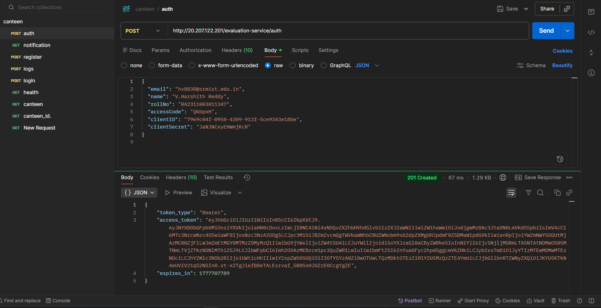
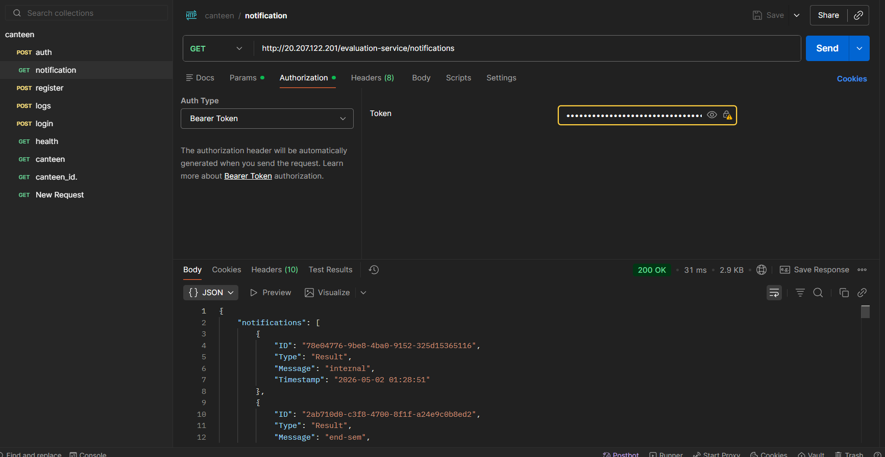
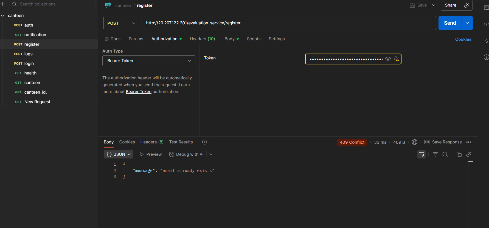

# Campus Hiring - Notification Priority Inbox

This project implements a Priority Inbox for a campus notification microservice. It dynamically ranks incoming notifications based on a combination of **Weight** (Placement > Result > Event) and **Recency**, utilizing a memory-efficient Min-Heap algorithm.

## Features
- **Dynamic Priority Sorting**: Uses a custom Min-Heap to guarantee $O(N \log K)$ sorting efficiency.
- **Top 'n' Selection**: Allows users to filter their inbox dynamically (e.g., Top 5, 10, 15, or 20) in real-time.
- **Seamless Authentication**: Implicit login flow bypassing unnecessary token exposure.
- **Secure Logging**: Fully integrates with the required backend logging middleware.

## Screenshots

### Inbox View 1

### Inbox View 2

### Inbox View 3

### Inbox View 4

### Inbox View 5

### Inbox View 6

